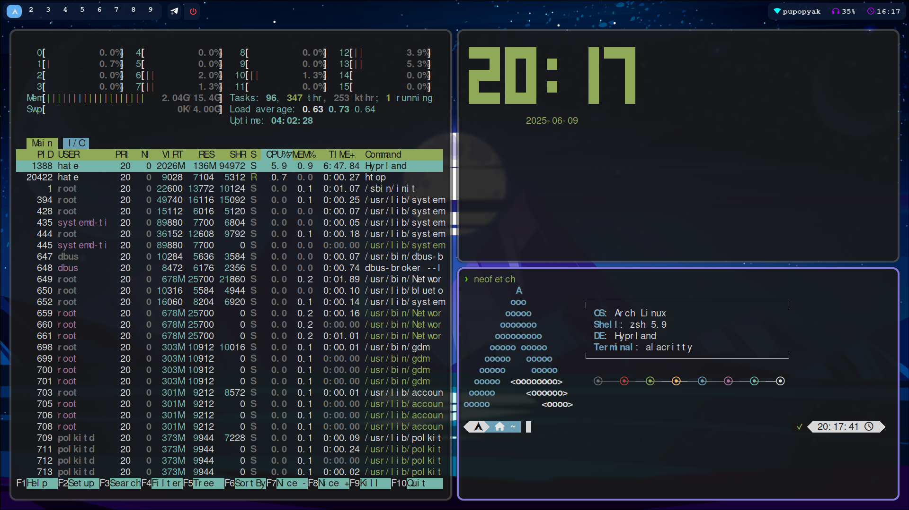
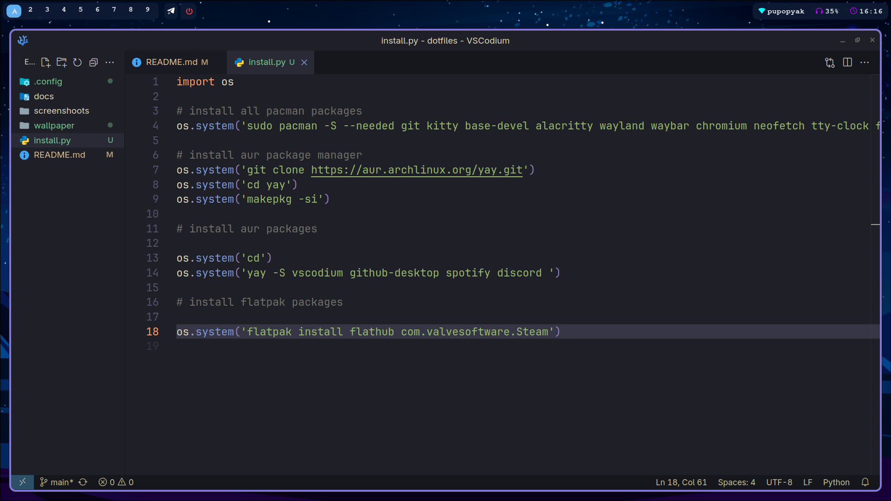

 

  

  <h3 align="center">best hyprland dots</h3>

  

    krakazabik Hyprland dotfiles 
     
    <a href="https://github.com/krakazabrik/dots/docs"><strong>Explore the docs »</strong></a>
     
     
    &middot;
  

    <h3 align="center">examples: </h3>
    
     
    
     
    

